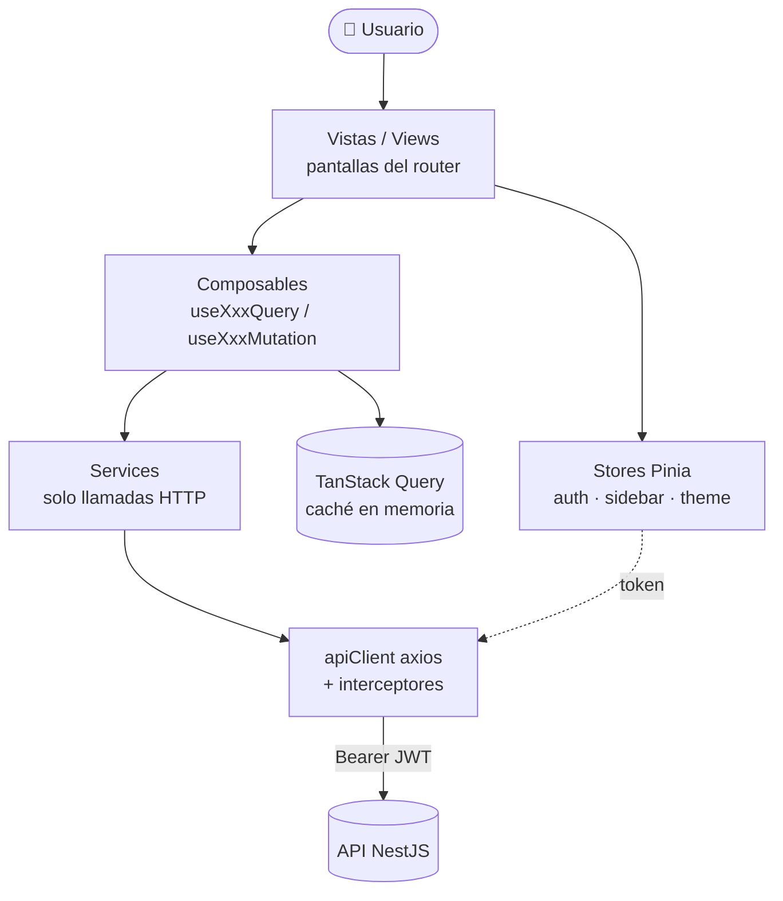
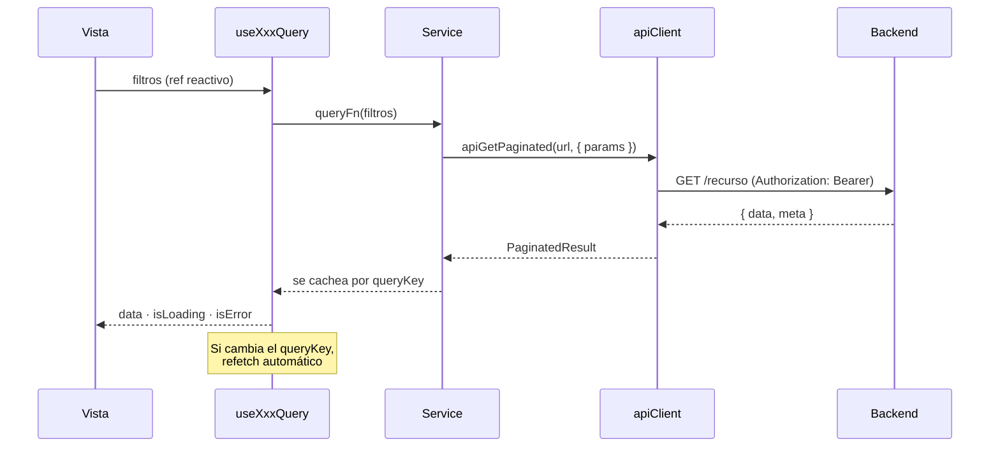
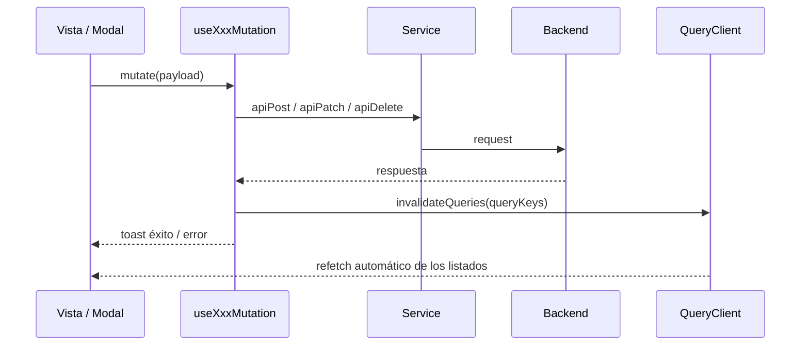
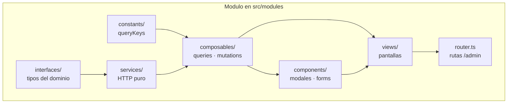
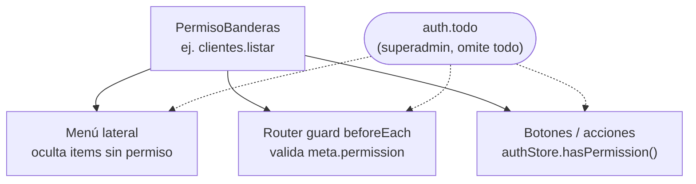
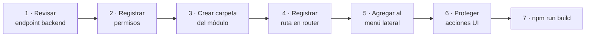

# Admin Sistema Sarita

Panel administrativo de **Oxígeno Sarita**. Frontend en Vue 3 + TypeScript + Vite, con arquitectura modular, Pinia, TanStack Query y componentes compartidos alineados al template TailAdmin.

---

## Stack tecnológico

| Tecnología | Versión | Propósito |
|---|---|---|
| Vue 3 | ^3.5 | Framework UI (Composition API, `<script setup>`) |
| TypeScript | ~6.0 | Tipado estático |
| Vite | ^8.1 | Bundler y dev server |
| Pinia | ^3.0 | Estado global (stores) |
| TanStack Query | ^5.101 | Caché y fetch de datos del servidor |
| Vue Router | ^5.1 | Enrutamiento SPA |
| Axios | ^1.18 | Cliente HTTP |
| Tailwind CSS | ^4.3 | Estilos utilitarios |
| VeeValidate + Yup | ^4.15 | Validación de formularios |
| Vue Sonner | ^2.0 | Toast notifications |
| Iconify | ^5.0 | Iconos (colección Lucide) |

---

## Requisitos

- Node.js 20+
- API backend en ejecución (`api-sistema-sarita`)
- Variable de entorno: `VITE_API_BASE_URL` (ej. `http://localhost:3000`)

```bash
# Instalar dependencias
npm install

# Iniciar dev server (puerto por defecto 5173)
npm run dev

# Build de producción
npm run build

# Vista previa del build
npm run preview

# Lint
npm run lint

# Formateo con Prettier
npm run format
```

---

## Arquitectura

### Estructura general

```
src/
├── modules/          # Funcionalidad por dominio (15 módulos)
├── shared/           # Código reutilizable entre módulos
│   ├── api/          # Cliente HTTP (axios + interceptors)
│   ├── components/   # UI compartida (form/, ui/)
│   ├── composables/  # Lógica reactiva reutilizable
│   ├── constants/    # Permisos, iconos, lista-ids
│   ├── interfaces/   # Tipos transversales
│   ├── plugins/      # Configuración de librerías (pinia, vue-query)
│   ├── utils/        # Helpers (fechas, paginación, tabla)
│   └── validation/   # Esquemas Yup y mensajes
├── router/           # Router principal + guards
├── assets/           # Estilos globales (Tailwind, utilidades de formulario)
├── App.vue           # Componente raíz
└── main.ts           # Punto de entrada
```

El módulo `admin` es especial: contiene el layout (sidebar, header), menú lateral y ensamblado de rutas hijas. No representa un dominio de negocio.

---

## Módulos del sistema

| Módulo | Descripción |
|---|---|
| `admin` | Layout principal, menú lateral, sidebar, cabecera |
| `auth` | Login, registro, recuperación de contraseña, store de sesión |
| `dashboard` | Página principal con resumen del sistema |
| `usuarios` | CRUD de usuarios del sistema |
| `roles` | CRUD de roles |
| `permisos` | CRUD de permisos |
| `clientes` | CRUD de clientes |
| `productos` | Artículos, catálogo de precios, categorías, subcategorías, stock, movimientos |
| `configuracion` | Configuración general: sucursales, almacenes, condiciones de pago, empresas, SUNAT, servicios |
| `contactos` | CRUD de contactos asociados a clientes |
| `direcciones` | CRUD de direcciones asociadas a clientes |
| `choferes` | CRUD de choferes |
| `vehiculos` | CRUD de vehículos |
| `catalogos` | Catálogos compartidos: ubigeo, listas de opciones |
| `consultas` | Consultas y reportes |

---

## Estructura de un módulo

Cada módulo de negocio vive en `src/modules/<nombre>/` y sigue esta convención:

```
src/modules/<nombre>/
├── interfaces/       # Tipos TypeScript del dominio (entidades, payloads, filtros)
├── services/         # Llamadas HTTP al backend (sin lógica de UI)
├── constants/        # Query keys de TanStack Query
├── composables/      # Hooks de datos (useQuery, useMutation)
├── components/       # Componentes propios del módulo (modales, formularios)
├── views/            # Páginas / pantallas completas
├── config/           # Configuración específica (breadcrumbs, items de menú)
├── validation/       # Esquemas Yup del dominio
└── routes.ts         # Rutas del módulo bajo /admin
```

### Propósito de cada carpeta

| Carpeta | Responsabilidad |
|---|---|
| **`interfaces/`** | Contratos de datos: entidades que devuelve la API, DTOs de creación/edición, filtros de listado y tipos auxiliares. Deben reflejar el backend. |
| **`services/`** | Capa de acceso a la API. Solo funciones async que llaman a `apiGet`, `apiPost`, `apiPatch`, `apiDelete` o `apiGetPaginated`. Sin estado ni UI. |
| **`constants/`** | Claves de caché para TanStack Query (`queryKeys`). Centralizan invalidaciones al mutar datos. |
| **`composables/`** | Lógica reactiva reutilizable dentro del módulo: `useXxxQuery` (lectura) y `useXxxMutation` (escritura), con toasts e invalidación de caché. |
| **`components/`** | Piezas de UI del dominio que no son una ruta completa: modales de formulario, selectores, sub-tablas, etc. Reutilizan componentes de `@/shared/components`. |
| **`views/`** | Vistas enlazadas al router: listados, detalle, dashboards del módulo. Orquestan composables, permisos y componentes. |
| **`routes.ts`** | Define las rutas hijas de `/admin`, con `meta.title`, `meta.permission` y lazy import de la vista. |

### Servicios adicionales

Si un módulo consume endpoints relacionados pero distintos (ej. `usuarios-roles` dentro de `usuarios`), se añade otro archivo en `services/` (`usuarios-roles.service.ts`) y composables asociados, sin crear un módulo separado salvo que el dominio lo justifique.

### Referencia: módulo `usuarios`

```
usuarios/
├── interfaces/usuario.interface.ts
├── services/
│   ├── usuarios.service.ts
│   └── usuarios-roles.service.ts
├── constants/usuariosQueryKeys.ts
├── composables/
│   ├── useUsuariosQuery.ts
│   ├── useUsuarioMutations.ts
│   ├── useUsuarioRolesQuery.ts
│   └── useUsuarioRolMutations.ts
├── components/UsuarioFormModal.vue
├── views/UsuariosListView.vue
└── routes.ts
```

---

## Autenticación y autorización

### Flujo de autenticación

1. El usuario inicia sesión en `/` (ruta guest)
2. El backend devuelve un JWT que se almacena en `auth.store.ts` (persistido con `pinia-plugin-persistedstate`)
3. El interceptor de Axios inyecta el token `Bearer` en cada petición
4. Si el backend responde con `401`, se limpia la sesión y se redirige al login

### Control de permisos

Los permisos se definen en `src/shared/constants/permissions.ts` y deben coincidir con los registros en la tabla `auth_permisos` de la base de datos.

```ts
PermisoBanderas.USUARIOS_LISTAR  // 'usuarios.listar'
PermisoBanderas.CLIENTES_CREAR   // 'clientes.crear'
```

Se aplican en tres capas:

1. **Menú lateral** — items condicionados con `permission`
2. **Router** — guard `beforeEach` que valida `meta.permission`
3. **UI** — botones y acciones condicionados con `authStore.hasPermission()`

El superadmin (permiso `auth.todo`) omite todas las validaciones.

---

## API Client

Cliente HTTP centralizado en `src/shared/api/apiClient.ts` basado en Axios.

### Funciones disponibles

| Función | Propósito |
|---|---|
| `apiGet<T>(url, config?)` | GET simple |
| `apiGetPaginated<T>(url, config?)` | GET con respuesta paginada `{ data, meta }` |
| `apiPost<T>(url, body?, config?)` | POST |
| `apiPatch<T>(url, body?, config?)` | PATCH |
| `apiPut<T>(url, body?, config?)` | PUT |
| `apiDelete<T>(url, config?)` | DELETE |

### Características

- Inyección automática del token JWT vía interceptor
- Manejo centralizado de errores `401` (sesión expirada)
- Tipado genérico con `ApiResponse<T>` y `PaginatedResult<T>`
- Error class personalizado `ApiError` con código HTTP y mensajes de validación

---

## Componentes compartidos

Importar desde `@/shared/components`:

| Componente | Ruta | Uso |
|---|---|---|
| `AppTable` | `ui/AppTable.vue` | Listados con columnas, slots `#actions`, `#toolbar`, `#footer` |
| `AppPagination` | `ui/AppPagination.vue` | Paginación sincronizada con `meta` de la API |
| `AppModal` | `ui/AppModal.vue` | Diálogos con header, body con scroll y footer |
| `AppBadge` | `ui/AppBadge.vue` | Etiqueta individual |
| `AppBadgeList` | `ui/AppBadgeList.vue` | Lista de etiquetas |
| `AppInput` | `form/AppInput.vue` | Campo de texto |
| `AppTextarea` | `form/AppTextarea.vue` | Área de texto |
| `AppSelect` | `form/AppSelect.vue` | Select desplegable |
| `AppCheckbox` | `form/AppCheckbox.vue` | Checkbox |
| `AppFileInput` | `form/AppFileInput.vue` | Carga de archivos |
| `AppFormField` | `form/AppFormField.vue` | Wrapper de campo con label y errores |
| `SearchableSelect` | `form/SearchableSelect.vue` | Select con búsqueda |
| `AppIcon` | `AppIcon.vue` | Icono Iconify (Lucide) |
| `ThemeToggler` | `ThemeToggler.vue` | Cambio de tema claro/oscuro |

---

## Estado global (Pinia)

| Store | Módulo | Propósito |
|---|---|---|
| `auth.store.ts` | `auth` | Sesión del usuario, token, permisos |
| `useAdminMenu` | `admin` | Estado del menú lateral |
| `useSidebar` | `admin` | Estado del sidebar (colapsado, mobile) |
| `useTheme` | `shared` | Tema claro/oscuro |

---

## Estilos

- **Tailwind CSS v4** con el plugin `@tailwindcss/forms`
- Tema claro/oscuro mediante clase `.dark` en `<html>` y variante `dark:` de Tailwind
- Archivos base en `src/assets/`:
  - `main.css` — directivas Tailwind y estilos globales
  - `form.css` — utilidades específicas para formularios
- PostCSS como preprocesador

---

## Convenciones de código

- **Componentes**: Vue 3 `<script setup lang="ts">`, Composition API
- **Tipado**: Tipos explícitos en props, emits, refs y reactive
- **Store**: Preferir `defineStore` con setup function sobre options API
- **Composables**: Prefijo `use`, archivos PascalCase
- **Servicios**: Objetos con métodos, sin clases
- **Query keys**: Jerarquía inmutable `all → lists → list(filters)`
- **Rutas**: Lazy loading con `() => import()`
- **Iconos**: Colección Lucide vía `@iconify/vue`, centralizados en `ICONS`

---

## Flujo para integrar un nuevo módulo

### 1. Revisar el backend

- URL base del recurso (ej. `/auth/usuarios`, `/clientes`)
- DTOs de entrada/salida y campos de paginación (`buscar`, `pagina`, `limite`)
- Permisos requeridos (`modulo.listar`, `modulo.crear`, etc.)
- Respuesta paginada: `{ data: T[], meta: { pagina, limite, total } }`

### 2. Registrar permisos

En `src/shared/constants/permissions.ts`:

```ts
export const PermisoBanderas = {
  CLIENTES_LISTAR: 'clientes.listar',
  CLIENTES_CREAR: 'clientes.crear',
} as const
```

### 3. Crear estructura del módulo

```
src/modules/clientes/
├── interfaces/cliente.interface.ts
├── services/clientes.service.ts
├── constants/clientesQueryKeys.ts
├── composables/
│   ├── useClientesQuery.ts
│   └── useClienteMutations.ts
├── components/ClienteFormModal.vue
├── views/ClientesListView.vue
└── routes.ts
```

### 4. Registrar rutas

En `src/router/index.ts`, importar y agregar al array `adminChildren`:

```ts
import { clientesRoutes } from '@/modules/clientes/router'
// ...
const adminChildren = [
  ...clientesRoutes,
]
```

El guard `beforeEach` ya valida `meta.permission` automáticamente.

### 5. Agregar al menú lateral

En `src/modules/admin/config/menu.ts`:

```ts
{
  icon: ICONS.users,
  name: 'Clientes',
  path: '/admin/clientes',
  permission: PermisoBanderas.CLIENTES_LISTAR,
}
```

### 6. Proteger acciones en la UI

```ts
const canCreate = computed(() =>
  authStore.hasPermission(PermisoBanderas.CLIENTES_CREAR),
)
```

### 7. Verificar

```bash
npm run build
```

---

## Variables de entorno

| Variable | Descripción | Valor por defecto |
|---|---|---|
| `VITE_API_BASE_URL` | URL base de la API backend | `http://localhost:3000` |

Copiar `.env.example` a `.env` y ajustar según entorno.

---

## 🧭 Guía visual para el desarrollador

Diagramas rápidos para entender cómo fluye todo. (Se renderizan en GitHub.)

### 1. Arquitectura en capas

Cada capa solo conoce a la de abajo. Las **vistas** nunca llaman a `axios` directo: pasan por composables → services → apiClient.



### 2. Lectura de datos (listado)



### 3. Escritura de datos (mutación)



### 4. Anatomía de un módulo



### 5. Permisos en 3 capas

Una misma bandera (`PermisoBanderas.X`) se aplica en el menú, el router y la UI.



### 6. Receta: agregar un módulo nuevo



> El detalle paso a paso está arriba, en **Flujo para integrar un nuevo módulo**.

---

## Licencia

Uso interno — Oxígeno Sarita
