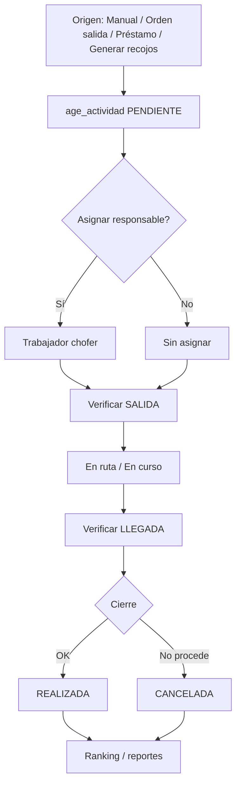

# Estado actual — Módulo Actividades

**Fecha del resumen:** 2026-09-08  
**Alcance:** frontend (`admin-sistema-sarita`) + backend (`api-sistema-sarita`)  
**Contexto de plan:** Fase 6 del [plan de reestructuración oxígeno](./plan-reestructuracion-oxigeno-sarita.md) — estado **parcial**.

---

## 1. Veredicto

Actividades es un módulo de **agenda operativa** maduro (CRUD, calendario, filtros, asignación de responsable, export Excel, alertas próximas) con **Fase 6 parcialmente cableada** (verificación por escaneo SALIDA/LLEGADA, ranking, generación de recojos, ítems con origen).

| Capa | Madurez | Notas |
|------|---------|--------|
| Agenda CRUD + UI | Alta | Lista / calendario / colaboradores funcionan |
| Verificación escaneo | Media-alta | API + modal UI listos |
| Recojos desde préstamo | Media | API lista; UI de “crear recojo préstamo” no invoca el endpoint |
| Auto-recojo / job | Baja | Solo botón/API manual; job no enganchado |
| Producto recogido | Baja | Columna/catálogo existen; no se escribe ni se muestra |
| Unificación con `balones/recojos` | Abierta | Decisión de negocio pendiente |

---

## 2. Arquitectura general

```
[Admin Vue]
  operativa/actividades (vista única + modales)
       │  HTTP (Vue Query)
       ▼
[API NestJS]
  Controller → ActividadesLogic → ActividadesModel
       │  callFunctionJson
       ▼
[PostgreSQL]
  tablas age_* + funciones age_*
```

- **Frontend:** arquitectura modular bajo `src/modules/operativa/actividades`. Sin Pinia propio; estado vía Vue Query + composables.
- **Backend:** no hay carpetas DDD clásicas (`domain/application/...`). El patrón del proyecto es **Controller → Logic → Model → funciones SQL**. La lógica de negocio vive sobre todo en PostgreSQL.

Prefijos:
- BD: `age_` (agenda/actividades)
- HTTP: `operativa/actividades` (controller Nest)
- Catálogos frontend (`ListaIds`): Tipo=48, Estado=49, Prioridad=50

---

## 3. Flujo de negocio

### 3.1 Ciclo de vida de una actividad

```
CREAR (PENDIENTE / PROGRAMADA)
   │
   ├─ Asignar / liberar responsable (no cambia estado)
   ├─ Verificar SALIDA (ítems)  ──┐
   ├─ Verificar LLEGADA (ítems) ─┤ no fuerzan cierre
   │
   ├─► Marcar REALIZADA  → fecha_hora_cierre = NOW()
   ├─► Cancelar          → CANCELADA + cierre
   └─► Eliminar          → baja lógica (estado=0)
```

Orden visual en listados (prioridad):

`PENDIENTE / PROGRAMADA` → otros → `CANCELADA` → `REALIZADA`

### 3.2 Tipos relevantes

| Catálogo | Valores usados |
|----------|----------------|
| **TipoActividad** | `REPARTO`, `RECOJO` (+ otros posibles en BD) |
| **EstadoActividad** | `PENDIENTE`, `PROGRAMADA`, `REALIZADA`, `CANCELADA`/`CANCELADO` |
| **PrioridadActividad** | al menos `ALTA` (recojos); MEDIA en defaults de UI |
| **EstadoVerificacionItem** (F6) | `PENDIENTE`, `OK`, `CON_OBSERVACION` |
| **TipoOrigenActividad** (F6) | `VENTA`, `ORDEN_SALIDA`, `PRESTAMO` |
| **EstadoProductoRecogido** (F6) | `RECOGIDO`, `NO_RECOGIDO`, `DANADO` *(diseñado, sin escritura)* |

### 3.3 Orígenes típicos

1. **Manual** desde operativa/actividades (formulario).
2. **Reparto desde orden de salida** (`DocumentoSalidaFormView` → “Agendar a reparto” / `ActividadFormModal` con `lockTipoReparto`).
3. **Recojo desde préstamo** (`POST .../recojo-prestamo`) — API lista, UI del módulo actividades **no la usa** aún.
4. **Generación masiva** de recojos por vencer (`POST .../generar-recojos`) — botón en toolbar.

### 3.4 Reglas de negocio fuertes (SQL)

- Título obligatorio (auto: `Reparto {serie}-{numero}` / GRE / orden si aplica).
- Un comprobante u orden **no** puede tener dos actividades vigentes (no canceladas).
- Tipo `REPARTO` + responsable → debe ser **trabajador chofer de flota propia** (`gen_chofer.id_cliente IS NULL`).
- Solape horario del mismo responsable el mismo día (excluye canceladas).
- Hora fin > hora inicio.
- Recojo por préstamo: **idempotente** si ya existe pendiente.
- Ítems de orden: vía `doc_obtener_salida` (sin re-tecleo).
- Ítems de venta: copia de `ven_comprobante_detalle`.
- Verificación: match por códigos de balón/serie/barra; ajenos van a bitácora con `coincide=false`.
- Trigger `trg_age_sync_responsable`: al setear `id_trabajador_responsable` sincroniza `id_chofer_responsable` + `id_usuario_responsable`.

---

## 4. Backend (API)

### 4.1 Archivos clave

| Rol | Ruta |
|-----|------|
| Module | `api-sistema-sarita/src/modules/actividades/actividades.module.ts` |
| Controller | `.../controllers/actividades.controller.ts` |
| Logic | `.../logic/actividades.logic.ts` |
| Model | `.../models/actividades.model.ts` |
| DTOs | `.../dto/actividades.dto.ts` |
| Permisos | `api-sistema-sarita/src/common/constants/permiso-banderas.ts` |

### 4.2 Endpoints REST

Base real en Nest: **`/operativa/actividades`**

| Método | Ruta | Permiso | Función SQL |
|--------|------|---------|-------------|
| `GET` | `/` | `actividades.listar` | `age_listar_actividades` |
| `GET` | `/proximas` | `actividades.listar` | `age_listar_actividades_proximas` |
| `GET` | `/ranking` | `actividades.ranking` | `age_ranking_usuarios` |
| `GET` | `/:id` | `actividades.ver` | `age_obtener_actividad` |
| `POST` | `/` | `actividades.crear` | `age_crear_actividad` |
| `POST` | `/recojo-prestamo` | `actividades.crear` | `age_crear_recojo_prestamo` |
| `POST` | `/generar-recojos` | `actividades.crear` | `age_generar_recojos_por_vencer` |
| `POST` | `/:id/verificar` | `actividades.verificar` | `age_registrar_verificacion` |
| `PATCH` | `/:id` | `actividades.editar` | `age_actualizar_actividad` |
| `PATCH` | `/:id/realizada` | `actividades.editar` | `age_cambiar_estado_actividad_realizada` |
| `PATCH` | `/:id/cancelar` | `actividades.editar` | `age_cancelar_actividad` |
| `PATCH` | `/:id/responsable` | `actividades.editar` | `age_asignar_responsable_actividad` |
| `DELETE` | `/:id` | `actividades.eliminar` | `age_eliminar_actividad` |

Auth: JWT global + `PermisosGuard`. Bypass: `AUTH_TODO`.

### 4.3 Persistencia

**Tablas**

| Tabla | Rol |
|-------|-----|
| `age_actividad` | Cabecera (cliente, responsable, tipo/estado/prioridad, fechas, `id_comprobante`, `id_doc_salida`, F6: `id_prestamo`, `id_tipo_origen`) |
| `age_actividad_item` | Ítems (producto, balón, cantidad, vínculos de origen, estados verificación salida/llegada, `id_estado_producto_recogido`) |
| `age_actividad_verificacion` | Bitácora de escaneos (`SALIDA`\|`LLEGADA`, código, coincide, observación) — creada en migración F6 |

**Funciones SQL** (`database_sql/funciones/actividades/`): 13 funciones `age_*` alineadas con la tabla de endpoints.

**Migraciones relevantes**

| Archivo | Qué aporta |
|---------|------------|
| `20260820_actividad_responsable_sync.sql` | Trigger sync responsable |
| `20260905_age_crear_actividad_items_orden_salida.sql` | Ítems desde orden |
| `20260905_reparto_desde_orden_salida.sql` | Vínculo venta↔reparto vía `doc_salida` |
| `20260908_f6_verificacion_escaneo.sql` | Catálogos F6, columnas, tabla verificación, permisos |
| `20260908_f6_items_desde_orden.sql` | Crear con detalle de orden + estados verificación |
| `20260908_f6_obtener_actividad_verificacion.sql` | Obtener con campos de verificación |
| `20260908_f6_funciones.sql` | Bundle: verificar, recojo, generar, ranking |

### 4.4 Relaciones con otros módulos

| Módulo / tabla | Uso |
|----------------|-----|
| `cli_clientes` (+ direcciones) | Cliente y coords en detalle/próximas |
| `tra_trabajadores` / `gen_chofer` / `auth_usuarios` | Responsable y sync |
| `ven_comprobante` (+ detalle) | Origen reparto; anti-duplicado; listados de ventas muestran actividad |
| `doc_salida` (+ detalle) | Origen principal de reparto actual |
| `pro_producto` / `bal_balon` | Ítems + match de escaneo |
| `bal_prestamo` (+ detalle) | Recojos F6 |
| `gen_lista` / `gen_lista_opciones` | Catálogos |
| `bal_recojo` | Módulo **separado**; unificación abierta |

Sin FK directa a sedes/categorías.

---

## 5. Frontend (Admin)

### 5.1 Estructura

Raíz: `src/modules/operativa/actividades/`

```
actividades/
├── router/index.ts
├── views/ActividadesView.vue
├── services/actividades.service.ts
├── interfaces/actividad.interface.ts
├── constants/actividadesQueryKeys.ts
├── composables/
│   ├── useActividadesQuery.ts
│   ├── useActividadDetailQuery.ts
│   ├── useActividadesProximasQuery.ts
│   ├── useRankingActividadesQuery.ts
│   └── useActividadMutations.ts
├── components/
│   ├── ActividadFormModal.vue
│   ├── ActividadDetailModal.vue
│   ├── ActividadVerificacionModal.vue
│   ├── ActividadesCalendar.vue
│   ├── ActividadesColaboradoresPanel.vue
│   └── ActividadesRankingPanel.vue
└── utils/
    ├── actividadEstado.ts
    ├── actividadTipo.ts
    ├── actividadHorario.ts
    ├── agruparActividadesPorColaborador.ts
    └── exportarActividadesExcel.ts
```

### 5.2 Ruta y UI

| Concepto | Valor |
|----------|-------|
| Path | `/admin/operativa/actividades` |
| Route name | `admin-operativa-actividades` |
| Meta permission | `actividades.listar` |
| Menú | Gestión → Actividades |

Query URL: `?tab=lista` (default) \| `calendario` \| `colaboradores`

**No hay** rutas hijas de detalle/crear/editar: todo es modal en la misma vista.

### 5.3 Pantallas / componentes

| Componente | Rol |
|------------|-----|
| `ActividadesView` | Orquestador: toolbar, filtros, alertas próximas, 3 tabs, menú acciones, modales |
| `ActividadFormModal` | Crear/editar (vee-validate + yup); modo reparto con `lockTipoReparto` |
| `ActividadDetailModal` | Detalle + ítems; tomar/liberar/cancelar/marcar realizada |
| `ActividadVerificacionModal` | Escaneo SALIDA/LLEGADA (`BalonBarcodeScanButton`) |
| `ActividadesCalendar` | FullCalendar; click fecha → crear; click evento → detalle |
| `ActividadesRankingPanel` | Ranking API (rango fechas, top 20) |
| `ActividadesColaboradoresPanel` | Ranking client-side de realizadas + modal por colaborador |

### 5.4 Formulario (campos)

1. **Datos generales:** título*, descripción  
2. **Asignación:** cliente (SearchableSelect), responsable trabajador (badge Chofer/cargo)  
3. **Clasificación:** tipo*, prioridad*, estado*  
4. **Programación:** fecha*, hora inicio*, hora fin*; en edit: fecha/hora cierre  
5. **Ítems del reparto** (preview si hay items/comprobante/GRE)  
6. **Observaciones**

Validación especial: cliente obligatorio si tipo `REPARTO`.

### 5.5 Flujos UI disponibles

| Flujo | Cómo |
|-------|------|
| Listar / filtrar / paginar | Tab Lista |
| Calendario | Tab Calendario (refetch por rango; límite 500) |
| Colaboradores | Ranking API + panel agrupado local |
| Crear / Editar | Modal |
| Detalle | Modal |
| Marcar realizada / Cancelar | Menú o detalle |
| Tomar / Liberar | Solo detalle (`asignarResponsable`) |
| Verificar | Menú → carga detalle → modal escaneo |
| Eliminar | Confirmación (baja lógica) |
| Alertas próximas | Banner “En curso” / “Próxima” (poll 30s, ventana 60 min) |
| Generar recojos | Botón toolbar |
| Export Excel | Según tab |
| Reparto desde orden | `DocumentoSalidaFormView` abre el form con defaults |

### 5.6 Permisos (frontend)

| Constante | Código |
|-----------|--------|
| `ACTIVIDADES_LISTAR` | `actividades.listar` |
| `ACTIVIDADES_VER` | `actividades.ver` |
| `ACTIVIDADES_CREAR` | `actividades.crear` |
| `ACTIVIDADES_EDITAR` | `actividades.editar` |
| `ACTIVIDADES_ELIMINAR` | `actividades.eliminar` |
| `ACTIVIDADES_VERIFICAR` | `actividades.verificar` |
| `ACTIVIDADES_RANKING` | `actividades.ranking` |

Definidos en `src/shared/constants/permissions.ts`.

### 5.7 Integraciones frontend

| Módulo | Integración |
|--------|-------------|
| Documentos de salida | “Agregar a reparto” → `ActividadFormModal` |
| Comprobantes | Badge actividad/reparto; cancelar reparto; **creación de reparto ya no** desde comprobante |
| Clientes / Trabajadores / Choferes | Selects del formulario |
| Catálogos | `useListaOpcionesQuery` |
| Balones | `BalonBarcodeScanButton` en verificación |
| Inventario | `documentoOrigenRoute` case `ACTIVIDAD` (**deep-link roto**, ver §7) |
| Prestamos/recojos balones | Siguen con `RecojoProgramarModal` propio; **no** usan `crearRecojoPrestamo` |

Mutaciones invalidan también `comprobantesQueryKeys` (vínculo con ventas).

---

## 6. Mapa del flujo end-to-end



---

## 7. Inconsistencias y deuda técnica

### 7.1 Prefijos API mixtos en el frontend (bug)

El controller Nest expone **todo** bajo `/operativa/actividades`, pero el servicio frontend llama Fase 6 **sin** ese prefijo:

| Acción | Frontend actual | Backend real |
|--------|-----------------|--------------|
| Verificar | `POST /actividades/:id/verificar` | `POST /operativa/actividades/:id/verificar` |
| Recojo préstamo | `POST /actividades/recojo-prestamo` | `POST /operativa/actividades/recojo-prestamo` |
| Generar recojos | `POST /actividades/generar-recojos` | `POST /operativa/actividades/generar-recojos` |
| Ranking | `GET /actividades/ranking` | `GET /operativa/actividades/ranking` |

CRUD clásico sí usa `/operativa/actividades`.

### 7.2 Deep-link desde inventario roto

`documentoOrigenRoute.ts` usa route name `admin-actividades`; la ruta real es `admin-operativa-actividades`. Además `ActividadesView` **no lee** `?id=` para abrir el detalle.

### 7.3 Drift de esquema SQL

- Sync `age_actividad.sql` aún documenta `id_guia_remision` → `gre_guia_remision`.
- Funciones actuales de crear/listar/obtener usan **`id_doc_salida`**.
- `age_actualizar_actividad.sql` puede seguir actualizando `id_guia_remision` → riesgo de inconsistencia.
- Tabla `age_actividad_verificacion` y columnas F6 **no** están reflejadas en los archivos sync de `tablas/actividades/`.

### 7.4 Otros

- Filtro `sinResponsable`: el `COUNT` filtra por `id_trabajador_responsable`, el `SELECT` por usuario/chofer.
- `age_cambiar_estado_actividad_realizada` busca `realizada` sin acotar lista `EstadoActividad` (más frágil que cancelar).
- Seed `gen_permisos_banderas.sql`: posible `;` mal puesto tras `actividades.eliminar` que rompe el `VALUES`.
- Ranking: columna `canceladas` en tipo API no se renderiza en UI.
- Tab Colaboradores: dos rankings (API vs agrupación local) pueden confundir.
- `estado_producto_recogido` en interface de ítem: no se muestra en detalle ni verificación.
- `useCrearRecojoPrestamoMutation` + API listos, **sin UI** que los invoque.
- Tipo `ActividadRepartoPrefill` definido; callers pasan props sueltas.

---

## 8. Qué está hecho vs qué falta (Fase 6)

### Hecho

- [x] CRUD agenda + calendario + filtros + export
- [x] Alertas de próximas / en curso
- [x] Asignar / liberar responsable
- [x] Marcar realizada / cancelar / eliminar (baja lógica)
- [x] Reparto desde orden de salida (UI + SQL)
- [x] Catálogos F6 (verificación, origen, producto recogido)
- [x] Tabla bitácora `age_actividad_verificacion`
- [x] API + UI de verificación por escaneo SALIDA/LLEGADA
- [x] API crear recojo desde préstamo (idempotente)
- [x] API + botón generar recojos por vencer
- [x] API + panel ranking
- [x] Permisos `actividades.verificar` y `actividades.ranking`

### Pendiente / parcial

- [ ] Corregir prefijos Fase 6 en `actividades.service.ts` (`/operativa/...`)
- [ ] UI que invoque `crearRecojoPrestamo`
- [ ] Mostrar / escribir `id_estado_producto_recogido`
- [ ] Job automático de recojos (hoy solo manual)
- [ ] Deep-link inventario → actividad (`admin-operativa-actividades` + `?id=`)
- [ ] Alinear sync SQL / `age_actualizar_actividad` con `id_doc_salida`
- [ ] Decisión: ¿`operativa/actividades` absorbe `balones/recojos`?
- [ ] Decisiones abiertas del plan: días antes (default provisional 3), responsable por defecto
- [ ] Unificar o clarificar los dos rankings del tab Colaboradores
- [ ] Mostrar estados de verificación por ítem también en el modal de detalle

---

## 9. Punto de partida sugerido para retomar

1. **Arreglar** las URLs Fase 6 del servicio frontend (prefijo `operativa/`).
2. **Probar** verificación + generar recojos + ranking end-to-end.
3. **Definir** si recojos de balones se absorben en actividades o se enlazan.
4. **Completar** producto recogido (SQL write + UI) y deep-link inventario.
5. **Enganchar** el job de auto-recojo al planificador de notificaciones cuando se cierre la decisión de días/responsable.

---

## 10. Referencias rápidas

### Frontend
- Vista: `src/modules/operativa/actividades/views/ActividadesView.vue`
- Servicio: `src/modules/operativa/actividades/services/actividades.service.ts`
- Interfaces: `src/modules/operativa/actividades/interfaces/actividad.interface.ts`
- Permisos: `src/shared/constants/permissions.ts`
- Menú: `src/modules/admin/config/menu.ts`
- Origen orden: `src/modules/documentos-salida/views/DocumentoSalidaFormView.vue`

### Backend
- Controller: `api-sistema-sarita/src/modules/actividades/controllers/actividades.controller.ts`
- Logic: `api-sistema-sarita/src/modules/actividades/logic/actividades.logic.ts`
- SQL funciones: `api-sistema-sarita/database_sql/funciones/actividades/`
- Migraciones F6: `api-sistema-sarita/database_sql/migraciones/20260908_f6_*.sql`

### Plan
- `docs/plan-reestructuracion-oxigeno-sarita.md` — sección **Fase 6**
