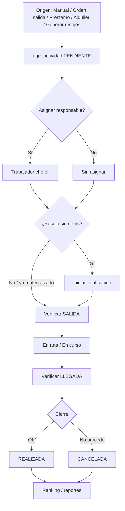

# Estado actual — Módulo Actividades

**Fecha del resumen:** 2026-09-09  
**Alcance:** frontend (`admin-sistema-sarita`) + backend (`api-sistema-sarita`)  
**Contexto de plan:** Fase 6 del [plan de reestructuración oxígeno](./plan-reestructuracion-oxigeno-sarita.md) — estado **parcial** (el texto “lo que falta” del plan aún no refleja el v2 de recojos).

**Qué cambió desde el resumen del 2026-09-08**

| Cuándo | Qué |
|--------|-----|
| 08/09 ~18:50 | Formulario de modal → páginas `/nueva` y `/:id/editar` |
| 08/09 ~19:23 | Recojo desde vencidos (préstamo/alquiler), prefijos F6 `/operativa/...`, `iniciar-verificacion` |
| 09/09 (código actual, staged) | Hora de inicio obligatoria en recojo; hora fin opcional en recojo; calendario por tipo; `estaAsignada` mira trabajador |
| 09/09 | Flujo RECOJO: `iniciar-recojo` → verificar LLEGADA → `culminar-recojo` + almacén → `bal_devolver_*` |

---

## 1. Veredicto

Actividades es un módulo de **agenda operativa** maduro (CRUD, calendario, filtros, asignación, Excel, alertas) con **Fase 6 casi cableada de punta a punta**: verificación por escaneo, ranking, recojo desde préstamo/alquiler (UI + API), generación masiva y materialización lazy de ítems.

| Capa | Madurez | Notas |
|------|---------|--------|
| Agenda CRUD + UI | Alta | Lista / calendario / colaboradores + páginas crear/editar |
| Verificación escaneo | Alta | API + modal + `iniciar-verificacion` (materializa ítems de recojo) |
| Recojos desde origen | Alta | UI + `POST /recojo` (PRESTAMO / ALQUILER); préstamo también desde listados |
| Auto-recojo / job | Baja | Solo botón/API manual; cron de notificaciones **no** crea actividades |
| Producto recogido | Media | Al culminar recojo los cilindros vuelven al almacén elegido (`bal_devolver_*`) |
| Unificación con `balones/recojos` | Abierta | Alquileres siguen usando `RecojoProgramarModal`; préstamos ya van a actividades |

---

## 2. Arquitectura general

```
[Admin Vue]
  operativa/actividades (listado + páginas form + modales detalle/verificar)
       │  HTTP (Vue Query)
       ▼
[API NestJS]
  Controller → ActividadesLogic → ActividadesModel
       │  callFunctionJson
       ▼
[PostgreSQL]
  tablas age_* + funciones age_*
```

- **Frontend:** arquitectura modular bajo `src/modules/operativa/actividades`. Sin Pinia propio; estado vía Vue Query + composables.
- **Backend:** no hay carpetas DDD clásicas (`domain/application/...`). El patrón del proyecto es **Controller → Logic → Model → funciones SQL**. La lógica de negocio vive sobre todo en PostgreSQL.

Prefijos:
- BD: `age_` (agenda/actividades)
- HTTP: `operativa/actividades` (controller Nest; el servicio frontend **ya usa este prefijo en todos los endpoints**)
- Catálogos frontend (`ListaIds`): Tipo=48, Estado=49, Prioridad=50

---

## 3. Flujo de negocio

### 3.1 Ciclo de vida de una actividad

```
CREAR (PENDIENTE / PROGRAMADA)
   │
   ├─ Asignar / liberar responsable (no cambia estado)
   │
   ├─ REPARTO:
   │     Verificar SALIDA → Iniciar entrega (EN_RUTA)
   │     → Verificar LLEGADA → Culminar entrega (REALIZADA)
   │
   ├─ RECOJO:
   │     Iniciar recojo (EN_RUTA + materializa ítems)
   │     → Verificar LLEGADA (escaneo de recogido)
   │     → Culminar recojo + almacén destino
   │        (bal_devolver_* → cilindro DISPONIBLE en ese almacén)
   │
   ├─ Otros tipos: Marcar REALIZADA (REPARTO/RECOJO no permiten marcar a mano)
   ├─► Cancelar          → CANCELADA + cierre
   └─► Eliminar          → baja lógica (estado=0)
```

Orden visual en listados (prioridad):

`PENDIENTE / PROGRAMADA` → otros → `CANCELADA` → `REALIZADA`

### 3.2 Tipos relevantes

| Catálogo | Valores usados |
|----------|----------------|
| **TipoActividad** | `REPARTO`, `RECOJO` (+ otros posibles en BD) |
| **EstadoActividad** | `PENDIENTE`, `PROGRAMADA`, `REALIZADA`, `CANCELADA`/`CANCELADO` |
| **PrioridadActividad** | al menos `ALTA` (recojos); MEDIA en defaults de UI |
| **EstadoVerificacionItem** (F6) | `PENDIENTE`, `OK`, `CON_OBSERVACION` |
| **TipoOrigenActividad** (F6) | `VENTA`, `ORDEN_SALIDA`, `PRESTAMO`, **`ALQUILER`** |
| **EstadoProductoRecogido** (F6) | `RECOGIDO`, `NO_RECOGIDO`, `DANADO` *(diseñado, sin escritura)* |

### 3.3 Orígenes típicos

1. **Manual** desde operativa/actividades (página `/nueva`).
2. **Reparto desde orden de salida** (`DocumentoSalidaFormView` → “Agendar a reparto” navega a `/nueva` con `lockTipoReparto` + `idDocSalida`).
3. **Recojo desde préstamo** — UI lista préstamos / antigüedad → `/nueva` con `lockTipoRecojo` + origen `PRESTAMO`; o selector de vencidos en el form.
4. **Recojo desde alquiler** — selector de vencidos en el form de actividades (`POST /recojo`). El listado de **alquileres** sigue abriendo `RecojoProgramarModal` (módulo `balones/recojos`), no actividades.
5. **Generación masiva** de recojos por vencer (`POST .../generar-recojos`) — botón en toolbar. Hora fija **08:00**.

### 3.4 Recojo: modelo lazy (ítems)

`age_crear_recojo_origen` crea **solo cabecera** (`items: 0`) con FK a préstamo o alquiler. Los ítems se materializan al llamar `POST .../iniciar-verificacion` (el modal de verificación lo dispara si el recojo aún no tiene detalle). Idempotente si ya existe recojo vigente (no cancelado/realizado).

### 3.5 Horarios (recojo)

| Flujo | Hora inicio | Hora fin |
|-------|-------------|----------|
| Recojo manual (`POST /recojo`) | **Obligatoria** | Opcional (se puede definir al culminar) |
| Alias `POST /recojo-prestamo` | Optional en DTO; SQL la exige vía origen | — |
| Generar recojos (batch) | Fija **`08:00`** | — |
| Reparto / actividad genérica | Obligatoria | Obligatoria; fin > inicio |

### 3.6 Reglas de negocio fuertes (SQL)

- Título obligatorio (auto: `Reparto {serie}-{numero}` / GRE / orden si aplica; recojo: `Recojo préstamo` / `Recojo alquiler`).
- Un comprobante u orden **no** puede tener dos actividades vigentes (no canceladas).
- Tipo `REPARTO` + responsable → debe ser **trabajador chofer de flota propia** (`gen_chofer.id_cliente IS NULL`).
- Solape horario del mismo responsable el mismo día (excluye canceladas).
- Hora fin > hora inicio **si hay hora fin**.
- Recojo por origen: **idempotente** si ya existe pendiente; `tipoOrigen` solo `PRESTAMO` o `ALQUILER`.
- Ítems de orden: vía `doc_obtener_salida` (sin re-tecleo).
- Ítems de venta: copia de `ven_comprobante_detalle`.
- Ítems de recojo: copiados del préstamo/alquiler (+ regulador en alquiler) al iniciar verificación.
- Verificación: match por códigos de balón/serie/barra; ajenos van a bitácora con `coincide=false`.
- Trigger `trg_age_sync_responsable`: al setear `id_trabajador_responsable` sincroniza `id_chofer_responsable` + `id_usuario_responsable`.

---

## 4. Backend (API)

### 4.1 Archivos clave

| Rol | Ruta |
|-----|------|
| Module | `api-sistema-sarita/src/modules/actividades/actividades.module.ts` |
| Controller | `.../controllers/actividades.controller.ts` |
| Logic | `.../logic/actividades.logic.ts` |
| Model | `.../models/actividades.model.ts` |
| DTOs | `.../dto/actividades.dto.ts` |
| Permisos | `api-sistema-sarita/src/common/constants/permiso-banderas.ts` |

### 4.2 Endpoints REST

Base real en Nest: **`/operativa/actividades`**

| Método | Ruta | Permiso | Función SQL |
|--------|------|---------|-------------|
| `GET` | `/` | `actividades.listar` | `age_listar_actividades` |
| `GET` | `/proximas` | `actividades.listar` | `age_listar_actividades_proximas` |
| `GET` | `/ranking` | `actividades.ranking` | `age_ranking_usuarios` |
| `GET` | `/vencidos-recojo` | `actividades.listar` | `age_listar_vencidos_recojo` |
| `GET` | `/:id` | `actividades.ver` | `age_obtener_actividad` |
| `POST` | `/` | `actividades.crear` | `age_crear_actividad` |
| `POST` | `/recojo` | `actividades.crear` | `age_crear_recojo_origen` |
| `POST` | `/recojo-prestamo` | `actividades.crear` | `age_crear_recojo_prestamo` → origen (alias, **deprecated**) |
| `POST` | `/generar-recojos` | `actividades.crear` | `age_generar_recojos_por_vencer` |
| `POST` | `/:id/iniciar-verificacion` | `actividades.verificar` | `age_iniciar_verificacion` |
| `POST` | `/:id/verificar` | `actividades.verificar` | `age_registrar_verificacion` |
| `PATCH` | `/:id` | `actividades.editar` | `age_actualizar_actividad` |
| `PATCH` | `/:id/realizada` | `actividades.editar` | `age_cambiar_estado_actividad_realizada` |
| `PATCH` | `/:id/cancelar` | `actividades.editar` | `age_cancelar_actividad` |
| `PATCH` | `/:id/responsable` | `actividades.editar` | `age_asignar_responsable_actividad` |
| `DELETE` | `/:id` | `actividades.eliminar` | `age_eliminar_actividad` |

Auth: JWT global + `PermisosGuard`. Bypass: `AUTH_TODO`.

### 4.3 Persistencia

**Tablas (contrato real por migraciones)**

| Tabla | Rol |
|-------|-----|
| `age_actividad` | Cabecera (cliente, responsable, tipo/estado/prioridad, fechas, `id_comprobante`, `id_doc_salida`, F6: `id_prestamo`, **`id_alquiler`**, `id_tipo_origen`) |
| `age_actividad_item` | Ítems (producto, balón, cantidad, vínculos de origen incl. `id_alquiler_detalle`, estados verificación salida/llegada, `id_estado_producto_recogido`) |
| `age_actividad_verificacion` | Bitácora de escaneos (`SALIDA`\|`LLEGADA`, código, coincide, observación) |

**Funciones SQL** (`database_sql/funciones/actividades/`): **16** funciones `age_*` alineadas con la tabla de endpoints.

**Migraciones relevantes**

| Archivo | Qué aporta |
|---------|------------|
| `20260820_actividad_responsable_sync.sql` | Trigger sync responsable |
| `20260905_age_crear_actividad_items_orden_salida.sql` | Ítems desde orden |
| `20260905_reparto_desde_orden_salida.sql` | Vínculo venta↔reparto vía `doc_salida` |
| `20260908_f6_verificacion_escaneo.sql` | Catálogos F6, columnas, tabla verificación, permisos |
| `20260908_f6_items_desde_orden.sql` | Crear con detalle de orden + estados verificación |
| `20260908_f6_obtener_actividad_verificacion.sql` | Obtener con campos de verificación |
| `20260908_f6_funciones.sql` | Bundle: verificar, recojo, generar, ranking |
| `20260908_age_id_doc_salida_y_ordenes_disponibles.sql` | Funciones dejan `id_guia_remision`; usan `id_doc_salida` |
| `20260908_age_obtener_actividad_item_detalle.sql` | Detalle de ítems enriquecido |
| `20260908_age_recojo_vencidos_fk.sql` | `id_alquiler`, origen ALQUILER, vencidos, crear origen, iniciar verificación |
| `20260909_age_crear_recojo_hora_inicio.sql` | Hora inicio **obligatoria** en `age_crear_recojo_origen` |
| `20260909_age_generar_recojos_hora.sql` | Batch pasa `TIME '08:00'` |

### 4.4 Relaciones con otros módulos

| Módulo / tabla | Uso |
|----------------|-----|
| `cli_clientes` (+ direcciones) | Cliente y coords en detalle/próximas |
| `tra_trabajadores` / `gen_chofer` / `auth_usuarios` | Responsable y sync |
| `ven_comprobante` (+ detalle) | Origen reparto; anti-duplicado; listados de ventas muestran actividad |
| `doc_salida` (+ detalle) | Origen principal de reparto actual; filtro “sin actividad vigente” |
| `pro_producto` / `bal_balon` | Ítems + match de escaneo |
| `bal_prestamo` (+ detalle) | Recojos F6 |
| `bal_alquiler` (+ detalle) | Recojos vencidos + iniciar verificación (incl. regulador) |
| `ven_garantia` | Contador en listado vencidos |
| `gen_lista` / `gen_lista_opciones` | Catálogos |
| `bal_recojo` | Módulo **separado**; alquileres UI aún lo usan |
| Notificaciones | Job 08:00 Lima notifica vencidos; **no** llama `age_generar_recojos_por_vencer` |

Sin FK directa a sedes/categorías.

---

## 5. Frontend (Admin)

### 5.1 Estructura

Raíz: `src/modules/operativa/actividades/`

```
actividades/
├── router/index.ts
├── views/
│   ├── ActividadesView.vue          # listado / tabs / modales detalle-verificar-delete
│   └── ActividadFormView.vue        # página crear/editar
├── services/actividades.service.ts
├── interfaces/actividad.interface.ts
├── constants/actividadesQueryKeys.ts
├── composables/
│   ├── useActividadesQuery.ts
│   ├── useActividadDetailQuery.ts
│   ├── useActividadesProximasQuery.ts
│   ├── useRankingActividadesQuery.ts
│   ├── useActividadMutations.ts
│   └── useVencidosRecojoQuery.ts
├── components/
│   ├── ActividadForm.vue            # form reutilizable (ya no hay ActividadFormModal)
│   ├── OrigenRecojoSelectField.vue
│   ├── ActividadDetailModal.vue
│   ├── ActividadVerificacionModal.vue
│   ├── ActividadesCalendar.vue
│   ├── ActividadesColaboradoresPanel.vue
│   └── ActividadesRankingPanel.vue
└── utils/
    ├── actividadEstado.ts
    ├── actividadTipo.ts
    ├── actividadHorario.ts
    ├── origenRecojoKey.ts
    ├── agruparActividadesPorColaborador.ts
    └── exportarActividadesExcel.ts
```

### 5.2 Ruta y UI

| Concepto | Valor |
|----------|-------|
| Listado | `/admin/operativa/actividades` → `admin-operativa-actividades` (`actividades.listar`) |
| Crear | `/admin/operativa/actividades/nueva` → `admin-operativa-actividades-nueva` (`actividades.crear`) |
| Editar | `/admin/operativa/actividades/:id/editar` → `admin-operativa-actividades-editar` (`actividades.editar`) |
| Menú | Gestión → Actividades |

Query URL listado: `?tab=lista` (default) \| `calendario` \| `colaboradores`

Query URL crear (prefill): `fecha`, `titulo`, `clienteId`, `clienteLabel`, `idDocSalida`, `lockTipoReparto`, `tipoOrigenRecojo`, `idOrigenRecojo`, `origenRecojoLabel`, `lockTipoRecojo`

**Detalle, verificación y eliminar** siguen siendo modales sobre el listado. **No hay** ruta `/:id` de ficha.

### 5.3 Pantallas / componentes

| Componente | Rol |
|------------|-----|
| `ActividadesView` | Orquestador: toolbar, filtros, alertas próximas, 3 tabs, menú acciones, modales |
| `ActividadFormView` | Página crear/editar; traduce query params a props del form |
| `ActividadForm` | Crear/editar (vee-validate + yup); modos `lockTipoReparto` / `lockTipoRecojo` |
| `OrigenRecojoSelectField` | Select remoto de vencidos (`PRESTAMO:id` / `ALQUILER:id`) |
| `ActividadDetailModal` | Detalle + ítems + `detalle_origen`; tomar/liberar/cancelar/marcar realizada |
| `ActividadVerificacionModal` | Escaneo SALIDA/LLEGADA (`BalonBarcodeScanButton`); auto `iniciar-verificacion` si hace falta |
| `ActividadesCalendar` | FullCalendar; colores por tipo (RECOJO naranja, REPARTO azul), canceladas grises; click fecha → crear; click evento → detalle |
| `ActividadesRankingPanel` | Ranking API (rango fechas, top 20) |
| `ActividadesColaboradoresPanel` | Ranking client-side de realizadas + modal por colaborador |

### 5.4 Formulario (campos)

1. **Datos generales:** título*, descripción  
2. **Asignación:** cliente (SearchableSelect), responsable trabajador (badge Chofer/cargo)  
3. **Clasificación:** tipo*, prioridad*, estado* (tipo bloqueado si lock reparto/recojo)  
4. **Programación:** fecha*, hora inicio*; hora fin* **salvo RECOJO** (opcional); en edit: fecha/hora cierre  
5. **Orden de salida** (create + REPARTO): `DocumentoSalidaSelectField` obligatorio  
6. **Origen del recojo** (create + RECOJO): `OrigenRecojoSelectField` + resumen cilindros/garantías/regulador  
7. **Preview ítems** / detalle origen  
8. **Observaciones**

Validación especial:
- Cliente obligatorio si tipo `REPARTO`.
- Orden de salida obligatoria al crear REPARTO.
- Origen vencido obligatorio al crear RECOJO.
- Hora fin > hora inicio solo si hay hora fin.

Submit recojo usa `POST /recojo` (`useCrearRecojoMutation`), no el CRUD genérico. `useCrearRecojoPrestamoMutation` existe (legacy) y **la UI no lo invoca**.

### 5.5 Flujos UI disponibles

| Flujo | Cómo |
|-------|------|
| Listar / filtrar / paginar | Tab Lista |
| Calendario | Tab Calendario (refetch por rango; límite 500; `visible` para `updateSize`) |
| Colaboradores | Ranking API + panel agrupado local |
| Crear / Editar | Páginas hijas |
| Detalle | Modal |
| Marcar realizada / Cancelar | Menú o detalle |
| Tomar / Liberar | Solo detalle (`asignarResponsable`) |
| Verificar | Menú → carga detalle → modal escaneo (+ iniciar verificación) |
| Eliminar | Confirmación (baja lógica) |
| Alertas próximas | Banner “En curso” / “Próxima” (poll 30s, ventana 60 min) |
| Generar recojos | Botón toolbar |
| Export Excel | Según tab |
| Reparto desde orden | Navega a `/nueva` con defaults |
| Recojo desde préstamo | Navega a `/nueva` con origen PRESTAMO |
| Recojo desde vencidos | Selector en el form (préstamo o alquiler) |

### 5.6 Permisos (frontend)

| Constante | Código |
|-----------|--------|
| `ACTIVIDADES_LISTAR` | `actividades.listar` |
| `ACTIVIDADES_VER` | `actividades.ver` |
| `ACTIVIDADES_CREAR` | `actividades.crear` |
| `ACTIVIDADES_EDITAR` | `actividades.editar` |
| `ACTIVIDADES_ELIMINAR` | `actividades.eliminar` |
| `ACTIVIDADES_VERIFICAR` | `actividades.verificar` |
| `ACTIVIDADES_RANKING` | `actividades.ranking` |

Definidos en `src/shared/constants/permissions.ts`.

### 5.7 Integraciones frontend

| Módulo | Integración |
|--------|-------------|
| Documentos de salida | “Agregar a reparto” → ruta `admin-operativa-actividades-nueva` |
| Préstamos / antigüedad | “Programar recojo” → misma ruta con `lockTipoRecojo` + `PRESTAMO` |
| Alquileres | Siguen `RecojoProgramarModal` (balones); el form de actividades **sí** acepta origen `ALQUILER` vía vencidos |
| Comprobantes | Badge actividad/reparto; cancelar reparto; **creación de reparto ya no** desde comprobante |
| Clientes / Trabajadores / Choferes | Selects del formulario |
| Catálogos | `useListaOpcionesQuery` |
| Balones | `BalonBarcodeScanButton` en verificación |
| Inventario | `documentoOrigenRoute` case `ACTIVIDAD` (**deep-link roto**, ver §7) |

Mutaciones invalidan también `comprobantesQueryKeys` (vínculo con ventas).

---

## 6. Mapa del flujo end-to-end



---

## 7. Inconsistencias y deuda técnica

### 7.1 Prefijos API mixtos — **resuelto**

El servicio frontend llama **todo** bajo `/operativa/actividades` (verificar, recojo, generar, ranking, vencidos, iniciar-verificación). El bug del 2026-09-08 ya no aplica.

### 7.2 Deep-link desde inventario — **sigue roto**

`documentoOrigenRoute.ts` usa route name `admin-actividades`; la ruta real es `admin-operativa-actividades`. Además `ActividadesView` **no lee** `?id=` para abrir el detalle (y no hay ruta de ficha `/:id`).

### 7.3 Drift de esquema SQL — **parcial**

- Funciones de crear / listar / obtener / **actualizar** usan **`id_doc_salida`** (ya no escriben `id_guia_remision`).
- Sync `tablas/actividades/age_actividad.sql` sigue documentando `id_guia_remision` → `gre_guia_remision` (congelado ~2026-09-02).
- Tabla `age_actividad_verificacion`, columnas F6 (`id_prestamo`, `id_alquiler`, verificación, producto recogido) **no** están en los archivos sync de `tablas/actividades/`.

### 7.4 Otros

| Ítem | Estado |
|------|--------|
| Filtro `sinResponsable` COUNT≠SELECT | **Arreglado** — ambos usan `id_trabajador_responsable` |
| `estaAsignada` en UI ignoraba trabajador | **Arreglado** — ahora mira trabajador / usuario / chofer |
| Seed `gen_permisos_banderas.sql`: `;` tras `actividades.eliminar` | **Sigue** (rompe el `VALUES`; `verificar`/`ranking` van en migración F6) |
| `age_cambiar_estado_actividad_realizada` busca `realizada` sin acotar lista `EstadoActividad` | **Sigue** |
| Ranking: columna `canceladas` en tipo API no se renderiza | **Sigue** |
| Tab Colaboradores: dos rankings (API vs agrupación local) | **Sigue** |
| `estado_producto_recogido` en interface de ítem | **Sigue** sin UI ni write SQL |
| `useCrearRecojoPrestamoMutation` | Legacy; UI usa `crearRecojo` unificado |
| Alquileres “Programar recojo” | Sigue en `balones/recojos`, no en actividades |
| Job auto-recojo | **Sigue** solo botón/API |

---

## 8. Qué está hecho vs qué falta (Fase 6)

### Hecho

- [x] CRUD agenda + calendario + filtros + export
- [x] Alertas de próximas / en curso
- [x] Asignar / liberar responsable
- [x] Marcar realizada / cancelar / eliminar (baja lógica)
- [x] Reparto desde orden de salida (UI página + SQL)
- [x] Formulario en páginas `/nueva` y `/:id/editar` (ya no modal)
- [x] Catálogos F6 (verificación, origen incl. ALQUILER, producto recogido)
- [x] Tabla bitácora `age_actividad_verificacion`
- [x] API + UI de verificación por escaneo SALIDA/LLEGADA
- [x] Prefijos Fase 6 del servicio frontend (`/operativa/...`)
- [x] API + UI crear recojo desde vencidos (PRESTAMO / ALQUILER)
- [x] Navegación “Programar recojo” desde préstamos / antigüedad
- [x] `iniciar-verificacion` (materializa ítems lazy)
- [x] API + botón generar recojos por vencer (hora 08:00)
- [x] Hora de inicio obligatoria en recojo; hora fin opcional
- [x] Calendario: colores por tipo/estado, layout al mostrar tab
- [x] API + panel ranking
- [x] Permisos `actividades.verificar` y `actividades.ranking`

### Pendiente / parcial

- [ ] Job automático de recojos (hoy solo manual; el cron de notificaciones no lo llama)
- [ ] Mostrar / escribir `id_estado_producto_recogido`
- [ ] Deep-link inventario → actividad (`admin-operativa-actividades` + abrir detalle)
- [ ] Alinear sync SQL (`tablas/actividades/`) con `id_doc_salida` + F6 + `id_alquiler`
- [ ] Decisión: ¿`operativa/actividades` absorbe `balones/recojos`? (alquileres aún en el módulo viejo)
- [ ] Enlazar “Programar recojo” de alquileres al form de actividades (como préstamos)
- [ ] Decisiones abiertas del plan: días antes (default provisional 3), responsable por defecto
- [ ] Unificar o clarificar los dos rankings del tab Colaboradores
- [ ] Mostrar estados de verificación por ítem también en el modal de detalle
- [ ] Corregir `;` en seed `gen_permisos_banderas.sql`

---

## 9. Punto de partida sugerido para retomar

1. **Probar** el circuito recojo: vencidos → crear con hora inicio → iniciar verificación → escaneo.
2. **Definir** si recojos de alquiler (y el módulo `balones/recojos`) se absorben en actividades o se enlazan.
3. **Completar** producto recogido (SQL write + UI) y deep-link inventario.
4. **Enganchar** el job de auto-recojo al planificador de notificaciones cuando se cierre la decisión de días/responsable.
5. **Sincronizar** archivos `database_sql/tablas/actividades/` con el esquema real.

---

## 10. Referencias rápidas

### Frontend
- Vista listado: `src/modules/operativa/actividades/views/ActividadesView.vue`
- Vista form: `src/modules/operativa/actividades/views/ActividadFormView.vue`
- Form: `src/modules/operativa/actividades/components/ActividadForm.vue`
- Servicio: `src/modules/operativa/actividades/services/actividades.service.ts`
- Interfaces: `src/modules/operativa/actividades/interfaces/actividad.interface.ts`
- Router: `src/modules/operativa/actividades/router/index.ts`
- Permisos: `src/shared/constants/permissions.ts`
- Menú: `src/modules/admin/config/menu.ts`
- Origen orden: `src/modules/documentos-salida/views/DocumentoSalidaFormView.vue`
- Origen préstamo: `src/modules/balones/prestamos/views/PrestamosListView.vue`

### Backend
- Controller: `api-sistema-sarita/src/modules/actividades/controllers/actividades.controller.ts`
- Logic: `api-sistema-sarita/src/modules/actividades/logic/actividades.logic.ts`
- SQL funciones: `api-sistema-sarita/database_sql/funciones/actividades/`
- Migraciones F6: `api-sistema-sarita/database_sql/migraciones/20260908_f6_*.sql` y `20260908_age_recojo_vencidos_fk.sql`
- Migraciones hora: `api-sistema-sarita/database_sql/migraciones/20260909_age_*.sql`

### Plan
- `docs/plan-reestructuracion-oxigeno-sarita.md` — sección **Fase 6** (el bullet “selector de recojo no está” ya no es cierto)
